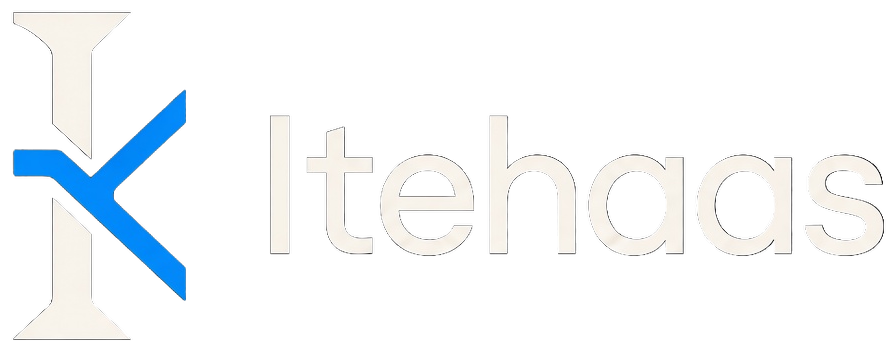

<p align="center">
  
</p>

<p align="center">
  <strong>Build a Git + GitHub from scratch — understand every layer.</strong><br/>
  Rust • Content-addressable storage • Distributed • Self-hosted on a single laptop
</p>

<p align="center">
  <a href="#quick-start">Quick start</a> •
  <a href="#architecture">Architecture</a> •
  <a href="#roadmap">Roadmap</a> •
  <a href="PLAN.md">Master Plan</a> •
  <a href="docs/object-model.md">Object Model</a>
</p>

---

Itehaas is a **Git-inspired distributed version-control system** and **GitHub-like platform** built from first principles. The goal is not a superficial clone — it is to understand and implement the fundamental ideas behind modern VCS: content-addressable storage, DAG history, staging, branching, three-way merge, and remote synchronization — then build a self-hosted collaboration platform on top.

> **Status:** All phases 0–10 complete — self-hosted release. VCS `init→pack/gc/fsck` + API `auth/repos/issues/PRs/CI` + Web `Next.js 7 routes` runnable. 65 Rust + 28 Server tests + web build green. `docker compose up` → M1–M9.

---

## Features (Phase 0 – 10)

| Area | Implemented |
|---|---|
| **Object model** | `blob` / `tree` / `commit` / `tag` — deterministic canonical serialization, `H(header\0body)` on **uncompressed** bytes, `zlib` stored, `SHA-256` via `Hasher` trait (one repo = one algo, mixed rejected) |
| **Storage** | Filesystem CAS `.itehaas/objects/ab/cdef…` (`2/62` fanout), atomic `tempfile→rename`, `64 MiB` limit, `6ef19b…` empty tree, NVMe (hot) / HDD (cold) tiering |
| **Workflow** | `index` (JSON `BTreeMap`, atomic) — `Working Tree → add → Index → commit → Objects` |
| **Branching** | `refs/heads/*`, `HEAD` symbolic/unborn/detached, hierarchical `feature/sub`, `branch` list/create/delete, `checkout`/`switch` with working-tree + index sync, dirty check, `-f` force |
| **Merge & Diff** | `diff` (wt vs index, `--staged` index vs `HEAD`, `HEAD` vs branch, unified via `similar`), common ancestor BFS, `is_ancestor`, fast-forward, `already-up-to-date`, 3-way `O/A/B` (`A==B→A`, `A==O→B`, `B==O→A` else `<<<<<<<` conflict), binary handling, `MERGE_HEAD` |
| **Remotes** | Filesystem own protocol (http deferred), `remote` add/list/remove, `clone` (reachability `commit→tree→blob→parents`, `refs/remotes/origin/*`, `checkout_branch_forced`), `fetch` (missing objects, `refs/remotes`), `push` (fast-forward check, `--force`), `pull` (`fetch` + `merge`) |
| **Server & API** | Fastify 4 + `pg` + `argon2id` + `zod`, `POST /api/auth/{register,login,logout,me}` `httpOnly SameSite=lax` 30d, `POST /api/repos` tx+`execItehaas init`, `GET/PATCH/DELETE /api/repos/:owner/:repo`, `GET /branches|log|tree/:hash` `canRead`, `POST /members` `read|write|admin` `canWrite/isAdmin`, `POST /fetch|push|pull` via `execItehaas`, `repoPathFor` guard + 30s timeout, Vitest 28 |
| **Web** | Next.js 14 + Tailwind, `dashboard → list/create`, `code browser` `branches/log/tree` `react-markdown`, `login/register`, `issues|pulls|ci` tabs, 7 routes build |
| **Collaboration** | `issues` `pull_requests` `pr_comments` `stars` `notifications` `activity` (`002_collaboration.sql`), `POST /issues|pulls` diff `execItehaas diff` merge `execItehaas merge`, star toggle |
| **CI/CD** | `ci_pipelines|jobs|secrets` (`003_ci.sql`), `POST /ci/run` queued→`simulateRun` `execItehaas log`→logs, `GET /ci/pipelines/:id` `GET /jobs/:id/logs`, `web/ci` polls, `docker --network none` deferred isolation |
| **Advanced VCS** | `pack` `ITEHAAS PACK v1` + `verify`, `gc` reachable BFS + `gc --prune`, `fsck` `verify_object` + `count-objects`, `itehaas fsck|gc|pack` + `vcs/tests/phase10_tests` 4 tests |

All 0–10 runnable via `docker compose up` or `cargo + pnpm dev`.

---

## Architecture

```
Browser
  → Next.js 14 (App Router, Tailwind)
  → Fastify (TypeScript) ──→ PostgreSQL 16 (metadata only)
          │
          └─→ Rust binary `itehaas` (spawn) ──→ .itehaas/objects (CAS)
```

**Monorepo, modular monolith** (`vcs/` Rust, `server/` Fastify, `web/` Next.js, `database/migrations/`) — no K8s/Kafka/ES on a single Vivobook (Ryzen 5 3500U, 4c/8t, 20 GB, 512 GB NVMe + 1 TB HDD, Ubuntu Server 24.04, Tailscale).

Decisions in `docs/decisions/ADR-*.md`, invariants in `docs/object-model.md` + `docs/storage.md`, branching/merging in `docs/branching-and-merging.md`.

---

## Quick start — Phase 6

```bash
# Build VCS + Server
cargo build -p itehaas
./target/debug/itehaas --help
pnpm install

# DB (choose one)
docker compose up -d db          # postgres:16 pgdata (docker-compose.yml:5)
# or brew install postgresql@16 && brew services start postgresql@16
pnpm --filter server migrate      # applies database/migrations/001_init.sql + _migrations

# Server
pnpm --filter server dev          # fastify 3001 (server/src/index.ts:8)
# or pnpm --filter server build && pnpm --filter server start

# Auth (http://localhost:3001)
curl -X POST http://localhost:3001/api/auth/register -H 'Content-Type: application/json' \
  -d '{"username":"alice","email":"alice@example.com","password":"longenough123"}' -i
curl -X POST http://localhost:3001/api/auth/login -H 'Content-Type: application/json' \
  -d '{"username":"alice","password":"longenough123"}' -c cookies.txt -b cookies.txt
curl http://localhost:3001/api/auth/me -b cookies.txt
curl http://localhost:3001/api/repos -b cookies.txt

# Create repo (DB + FS)
curl -X POST http://localhost:3001/api/repos -H 'Content-Type: application/json' -b cookies.txt \
  -d '{"name":"demo","visibility":"private"}'
ls data/repos/alice/demo/.itehaas  # VCS CAS created

# VCS quick start (same as Phase 5)
./target/debug/itehaas init /tmp/demo && cd /tmp/demo
itehaas config user.name "Your Name" && itehaas config user.email "you@example.com"
echo "hello" > hello.txt && itehaas add hello.txt && itehaas commit -m "initial"
itehaas log --oneline && itehaas branch feature && itehaas checkout feature
echo "feature" >> hello.txt && itehaas add hello.txt && itehaas commit -m "feature"
itehaas checkout main && itehaas merge feature
itehaas clone /tmp/demo /tmp/clone && cd /tmp/clone && itehaas log --oneline

# API: repo browsing via VCS
curl http://localhost:3001/api/repos/alice/demo/branches -b cookies.txt
curl http://localhost:3001/api/repos/alice/demo/log -b cookies.txt

# Tests
cargo test -p itehaas                            # 61 tests
pnpm --filter server test                        # 28 tests (vitest.config.ts:1)
```

---

## Object model

Central invariant:

```
ObjectID     = H(canonical_header || 0x00 || canonical_body)
Stored bytes = zlib(canonical_header || 0x00 || canonical_body)
```

Hashing **always on uncompressed** canonical bytes. See `docs/object-model.md` (source of truth) and `docs/storage.md` (layout: `.itehaas/{HEAD,config,index,objects,refs}`).

---

## Development

```bash
cargo test -p itehaas          # Rust unit + integration (61)
pnpm --filter server test      # Vitest (28) server/src/lib + api
pnpm --filter server build     # tsc → dist
cargo build -p itehaas         # binary at target/debug/itehaas
./target/debug/itehaas --help  # all commands

# Roadmap tracking
cat PLAN.md                    # master plan, 140/140 Phase 6 complete
cat docs/api.md && cat docs/database.md && cat docs/security.md
```

Phases `0` → `6` (M1 First Object → M5 First Remote → Server API) are complete and runnable. Each phase `test → docs → commit` and remains `cargo test && pnpm test` green.

---

## Deployment (single laptop)

- **Bare metal (dev):** `cargo run -p itehaas` + `pnpm dev` + `brew services start postgresql@16` — no Docker.
- **Compose (prod-like):** `docker compose up` (Next.js + Fastify + Postgres + `itehaas` binary + optional runner) — `NVMe` for `.itehaas` hot, `HDD` for backups; `Tailscale` for remote access.

See `docs/deployment.md` (planned Phase 6+) and `docker-compose.yml`.

---

## Roadmap

| Phase | Description | Status |
|---|---:|---|
| 0 | Environment & Architecture | ✅ |
| 1 | Object Model & Store | ✅ |
| 2 | Index, Staging & Workflow | ✅ |
| 3 | Branches & HEAD | ✅ |
| 4 | Diff & Merge | ✅ |
| 5 | Remotes | ✅ |
| 6 | Server & API | ✅ |
| 7 | Web Platform | ✅ |
| 8 | Collaboration | ✅ |
| 9 | CI/CD | ✅ |
| 10 | Advanced VCS / Git Interop | ✅ |

Milestones `M1` → `M9` achieved: `M6` Web repo (Next.js browse), `M7` PR (create→merge), `M8` CI (`push→queued→logs`), `M9` Self-Hosted (`docker compose up`). All 0–10 runnable.

---

## Security & Performance

- No `unsafe`, no shell, `hash ^[0-9a-f]{64}$` (`server/src/lib/vcs.ts:6`), `repoPathFor` `startsWith(root+sep)` (`server/src/lib/vcs.ts:17`), `argon2id` (`server/src/lib/auth.ts:4`), `httpOnly SameSite=lax` (`server/src/routes/auth.ts:42`), `zod` + `pg` param, `zlib` bomb `64MiB`.
- Bounded concurrency (`Tokio` 4 workers on 3500U, `spawn` 30s timeout + 1MiB cap `server/src/lib/vcs.ts:33`), `flate2` level `6`, `Postgres` pool 10 (`server/src/db/index.ts:4`), `docker-compose.yml:5` pgdata.
- CI runner (Phase 9) will be `docker run --network none --memory 512m --pids-limit 128`, never host exec.

---

## License

MIT — see `LICENSE`.

## Acknowledgments

Inspired by *Git* (object model, DAG, refs, index, merge) and *GitHub* (collaboration). Not a Git wrapper — the VCS is implemented from scratch in Rust to learn systems engineering.

*Built with understanding first, code second.*
